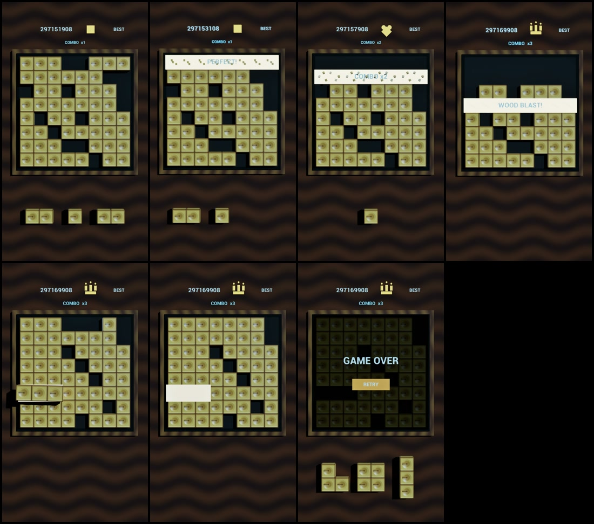

# Block Rush UE StoryV7 制作记录

## 交付文件

- [最终视频](../videos/BlockRushV3_StoryV7_1080x1920.mp4)
- 规格：1080 × 1920，30 fps，30.00 秒，H.264 / yuv420p，共 900 帧
- SHA-256：`EE2F9C4D0DEA67A524CF456B08B5498110D00C4C195E34016A3E14EF0FBAF226`

关键帧从左到右：开场、第一次消除、爱心 Combo、皇冠 Combo、正确答案诱导、故意错放、Game Over / Retry。

## UE 内容位置

- 地图：`/Game/BlockRushV3_ThreeJSMatch/Maps/L_BlockRush_V3_Lookdev`
- 最终序列：`/Game/BlockRushV3_ThreeJSMatch/Sequences/LS_BlockRush_V3_Reference_30s_StoryV7`

UE 工程文件不在本次交付范围内，没有加入仓库提交。

## 画面还原

- 8 × 8 棋盘，格距 100 cm；方块宽 102 cm，彼此轻微覆盖，消除可见缝隙。
- 方块高 48 cm，使用独立凹槽网格与木质纹理，保留明确的侧面、边缘和投影体积。
- 方块为暖象牙金色，棋盘为深灰黑木色，背景为暖棕色，主体与背景保持高明度对比。
- 固定竖屏相机、暖色主光、无阴影补光、矩形柔光和固定曝光。
- 拖动时正确落点显示暖白色高亮；最终诱导段中，即使方块转向错误位置，提示仍持续可见，直到 Game Over 出现。

## 30 秒时间线

| 时间 / 帧 | 内容 |
|---|---|
| 0–7 秒 / 0–210 | 第一个正确落子并消除；BEST 为方块，Combo x1。 |
| 7–11 秒 / 210–330 | 第二次正确消除；BEST 切为爱心，Combo x2。 |
| 11–14.5 秒 / 330–435 | 第三次正确消除；BEST 切为皇冠，Combo x3。 |
| 15 秒 / 450 | 切入经过求解验证的最终棋盘。 |
| 16 秒 / 480 | 三格正确位置持续显示白色提示。 |
| 19–21.5 秒 / 570–645 | 横三格悬停在正确位置，随后故意转向。 |
| 24 秒 / 720 | 横三格落到错误位置，不产生消除。 |
| 25 秒 / 750 | 显示下一组三种候选木块；它们均无合法位置。 |
| 29 秒 / 870 | 严格触发 Game Over，并显示 Retry。 |

## Combo 规则

- 方块 / x1 → 爱心 / x2 → 皇冠 / x3。
- 当前清除动作计入步数；第 3 步以内消除会提升等级。
- 第 4 步才消除会中断原连击，并重新从方块 / x1 开始。
- 分数、图案和倍率文字在同一帧更新。

## 失败条件验证

- 最终横三格只有两个合法落点。
- 正确落点会同时完成第 6 行和第 1–3 列，共清除 29 个不同格子。
- 故意选择的错误落点不会完成任何行或列。
- 错误落子后，竖三格、2 × 2、L 三格三种候选形状的合法位置数量均为 0。

## 输出验证

- UE Movie Render Queue 输出 `0000–0899` 共 900 张 1080 × 1920 PNG。
- FFmpeg 编码为 H.264；FFprobe 复核为 1080 × 1920、30/1 fps、900 帧、30.000 秒。
- 首帧、爱心阶段、三次消除、正确提示、故意错放及 Retry 末帧均完成截图核对。
