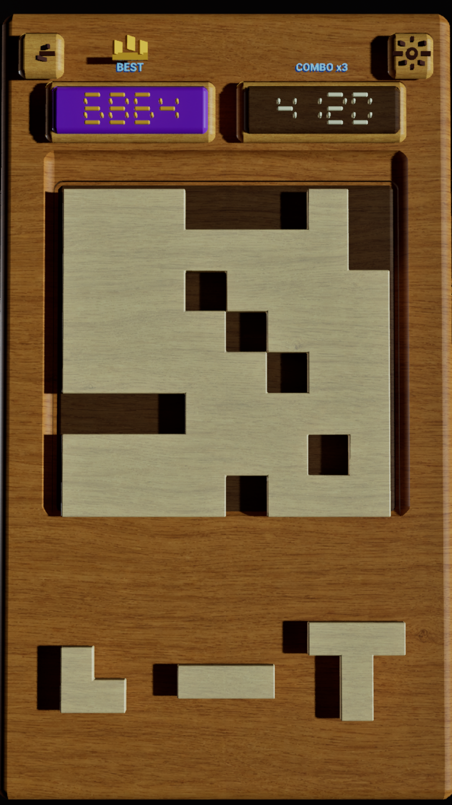
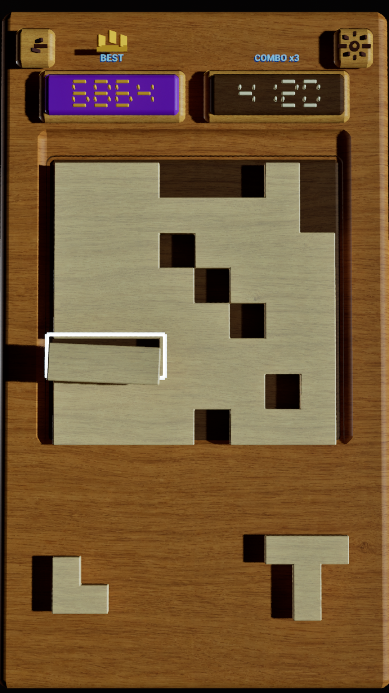
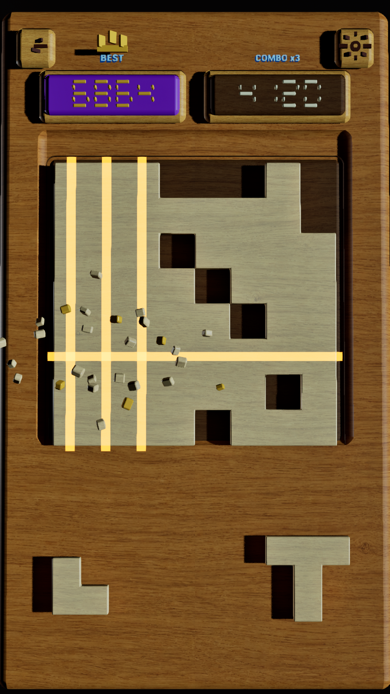

# Block Rush R4 审核包

这里保存的是 **R4 原始输出与制作过程**，用于审核后决定如何直接在 R4 基础上修改。

本目录不包含 Unreal Engine 工程、`.uasset`、缓存或 R5 内容。

## 输出结果

- [R4 UE 序列预览视频（1080 × 1920，30 fps，4 秒）](./videos/BlockRushV4_StylePreview_1080x1920.mp4)
- [制作过程、参数与已知问题](./process/BlockRushV4_Process.md)

### 01 — Opening

### 02 — Bright outline hint

### 03 — Multi-clear

## 审核重点

R4 已经具备厚实整块木板、无缝浅色棋盘块、纵深凹槽、空心白色动态提示和消除反馈。当前需要重点审核的是顶部实体 UI 的厚度、整体光照方向与颜色、阴影黑度、下方候选块阴影，以及文字和数字的精致度。
