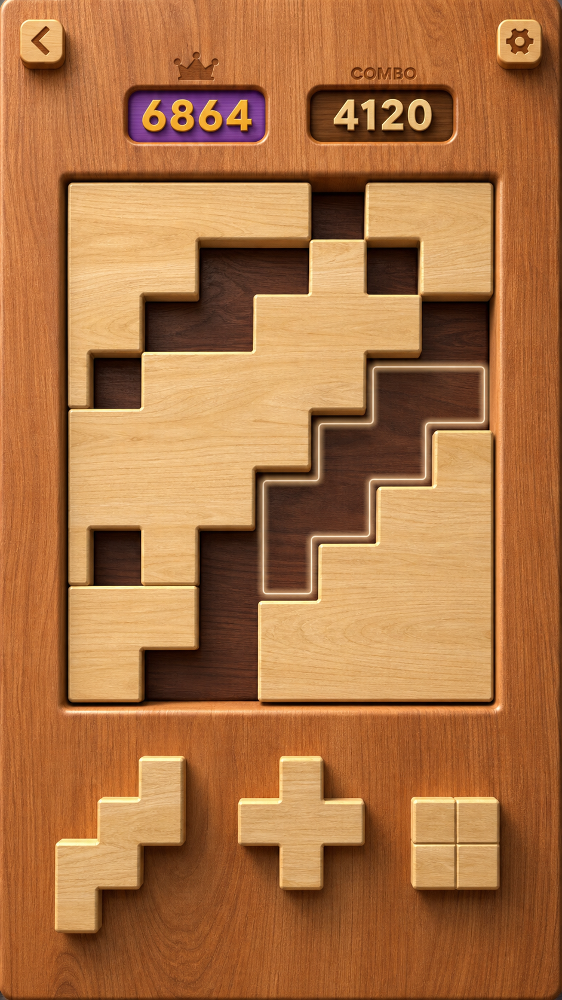
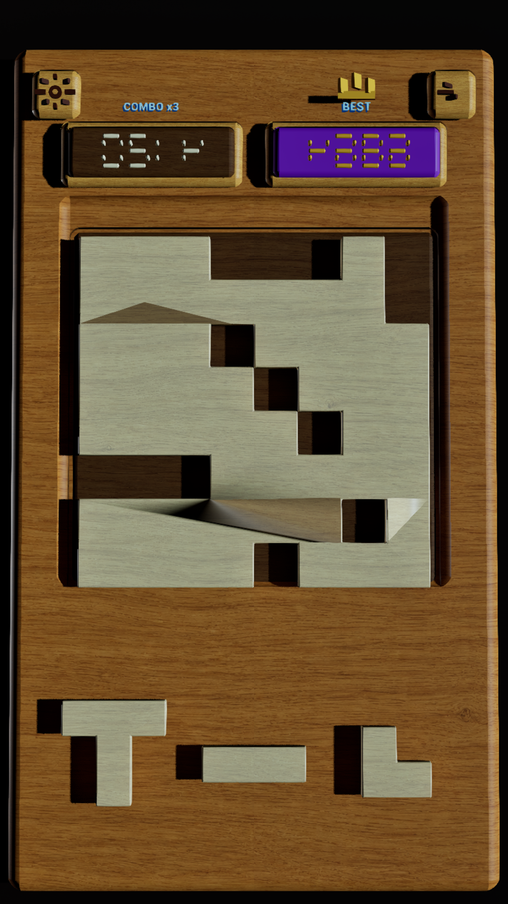
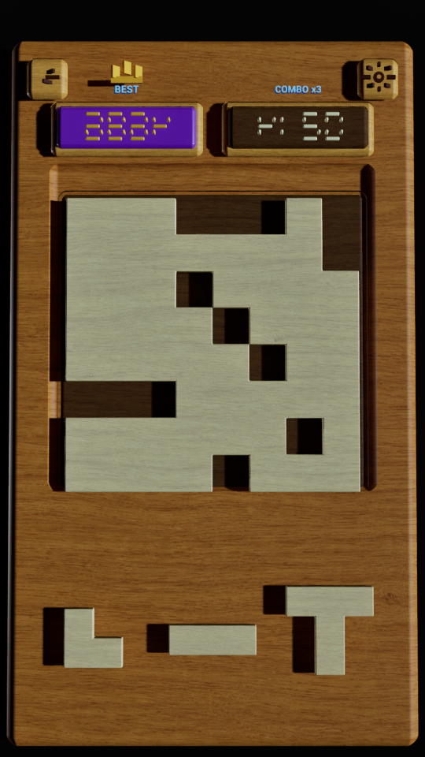

# Block Rush R4 制作记录

## 1. 审核范围

这次提交只归档 R4 的输出结果和制作过程，方便在同一个版本基线上审核与继续修改。

包含：

- R4 的真实 Unreal Engine Level Sequence 预览视频；
- Opening、白色线框提示、Multi-clear 三张 1080 × 1920 关键帧；
- 已确认的画面风格目标、中间探针图和法线修复前画面；
- R4 的结构、灯光、镜头、动画节点和复现脚本。

不包含：

- Unreal Engine 工程文件和 `.uasset`；
- `DerivedDataCache`、`Intermediate`、`Saved` 等缓存；
- R5 或后续试改结果；
- 120 张视频源序列帧。

## 2. R4 输出

| 内容 | 文件 | 说明 |
| --- | --- | --- |
| UE 序列预览 | [BlockRushV4_StylePreview_1080x1920.mp4](../videos/BlockRushV4_StylePreview_1080x1920.mp4) | 1080 × 1920，30 fps，120 帧，4 秒 |
| Opening | [BlockRushV4_01_Opening.png](../renders/BlockRushV4_01_Opening.png) | R4 第 0 帧 |
| 白色线框提示 | [BlockRushV4_02_BrightOutlineHint.png](../renders/BlockRushV4_02_BrightOutlineHint.png) | R4 第 45 帧 |
| Multi-clear | [BlockRushV4_03_MultiClear.png](../renders/BlockRushV4_03_MultiClear.png) | R4 第 68 帧 |

视频 SHA-256：`D83D6C4564737E50635A5B114FF88C183985F9A6D5020B2A63D8F04F2B3ACCBF`

## 3. UE 内保留的 R4 资产位置

- Map：`/Game/BlockRushV4_ChoppingBoard/Maps/L_BlockRush_V4_ChoppingBoard`
- Level Sequence：`/Game/BlockRushV4_ChoppingBoard/Sequences/LS_BlockRush_V4_StylePreview_R4`
- Camera：`CAM_BlockRushV4_Portrait`
- 时间线：120 帧，30 fps，共 4 秒
- 关键状态：第 0 帧 Opening、第 45 帧白色线框提示、第 68 帧 Multi-clear

这些资产仍保留在本机 UE 工程中。本提交只记录路径，没有上传工程资产。

## 4. 制作过程

### 4.1 风格目标

先以已确认参考图确定画面语言：整块厚实切菜板、暖色实木、浅色棋盘主体、深色凹槽、实体木块 UI 和更明亮的空心白色提示。

### 4.2 切菜板与棋盘结构

- 外层切菜板约为 `1120 × 1940 × 90`，四周倒角，表现厚实整板；
- 中央开出约 `900 × 900` 的深色凹槽，内部可见底板约 `852 × 852 × 10`；
- 棋盘为 `8 × 8`，单格基准 `100`；
- 浅色棋盘块使用连续行段合并成实体网格，块与块之间不留缝；
- 棋盘块厚度 `36`，棋盘顶部基准 `Z = 90`，凹槽底板顶部基准 `Z = 74`；
- 浅色主体与深色槽底使用不同木材明度，建立明确前后层次。

### 4.3 法线与体积修复

第一次输出出现大面积顶面明暗断裂和错误斜面，记录如下：

R4 最终版本采用以下处理：

1. 按约 `52°` opening angle 和 polygroup 拆分硬边；
2. 使用角度/面积加权的平滑法线；
3. 对近水平顶面三角形强制使用 `+Z` 法线；
4. 完成后关闭额外的自动重算法线，避免顶面再次被错误平滑。

这一部分解决了浅色棋盘主体的大面积脏灰和破面，是继续修改时应保留的 R4 基线。

### 4.4 实体 UI 与候选木块

- 左上返回按钮和右上设置按钮使用 `112 × 112 × 28` 的实体木块；
- 两个分数牌外框约 `418 × 150 × 23`，内嵌面约 `382 × 116 × 17`；
- 下方候选块使用 L 形、横向三格和 T 形组合，顶面位于约 `Z = 94`；
- R4 中候选块仍开启投影，这是当前审核中明确需要修正的部分。

### 4.5 白色线框提示

提示不是白色实心块，而是由两层空心边框组成：

- 外层柔光 Halo：透明度约 `0.28`、发光强度约 `8`；
- 内层高亮 Core：透明度约 `0.98`、发光强度约 `18`；
- 动画窗口约为第 `30–60` 帧，第 `45` 帧达到最亮；
- 高亮与浅色木块拉开明度，保留明显但柔和的动态发光边缘。

### 4.6 消除表现

- Multi-clear 动画窗口约为第 `60–80` 帧；
- 第 `68` 帧为金色线条、木屑和闪光的峰值；
- 该状态用来确认“连续正确放置后爽快消除”的视觉反馈方向。

### 4.7 R4 灯光与镜头记录

R4 渲染时的关键记录值：

- Camera：位置约 `(0, -70, 3150)`，目标约 `(0, 50, 35)`；
- Lens：约 `56 mm`，传感器约 `20.25 × 36`；
- Key Directional Light：旋转约 `(-72, -28, 0)`，强度约 `3.55`，Source Angle 约 `9°`；
- Bounce Directional Light：旋转约 `(-48, 142, 0)`，强度约 `0.88`；
- Rect Light：位置约 `(460, 120, 1450)`，旋转约 `(0, -90, 0)`，强度约 `1250`；
- Skylight：强度约 `0.42`；
- Post Process：Exposure Compensation 约 `+0.35`，Bloom 约 `0.11`，Vignette 约 `0.10`；
- Ambient Occlusion：强度约 `0.72`，半径约 `85`。

这些数值用于忠实记录 R4，不代表下一版建议值。

## 5. 中间验证方式

先用低分辨率探针确认镜头、构图与材质，再输出 1080 × 1920 关键帧和完整序列。

随提交附带的脚本：

- [`ue_open_v4_style_opening.py`](./scripts/ue_open_v4_style_opening.py)：打开 R4 Map、Sequence，并锁定竖屏相机到第 0 帧；
- [`ue_start_v4_style_preview_render.py`](./scripts/ue_start_v4_style_preview_render.py)：通过 Movie Render Queue 输出 1080 × 1920、30 fps PNG 序列；
- [`ue_v4_style_render_status.py`](./scripts/ue_v4_style_render_status.py)：查询 Movie Render Queue 是否仍在渲染。

渲染脚本中的 `OUTPUT_DIR` 是当次制作机器的实际输出位置；在其他机器复现时只需改这一项。PNG 序列随后编码为 H.264、`yuv420p` 的 MP4。

## 6. R4 已知问题（本次未修改）

为了让审核准确，这次归档保持 R4 原样，以下问题没有在提交前偷偷修正：

1. 顶部按钮与分数牌整体过厚、过高，视觉重量明显大于目标参考；
2. 主光方向不理想，画面偏灰，浅色木块没有目标图中的暖亮通透感；
3. 棋盘与凹槽阴影过黑、过硬，局部对比压死了木纹；
4. 下方候选木块的长阴影过重，目标是取消或显著减弱这些阴影；
5. 顶部标签颜色受颜色通道参数顺序影响出现偏蓝，应改用明确的关键字通道值；
6. 七段式数字过于机械，按钮、文字与图案精细度仍低于右侧目标参考；
7. 棋盘主体目前是大面积连体浅木板加孔洞的设计，需要审核是否保留这一结构语言；
8. 白色空心动态线框方向正确，后续只需继续提高亮度区分并微调柔光，不应改回实心白块。

## 7. 建议的 R4 原位修改边界

建议保留：

- R4 Map、Sequence 和竖屏镜头结构；
- 切菜板尺寸、凹槽层级与无缝棋盘网格；
- 已修复的顶面法线与硬边处理；
- 空心双层白色提示和现有动画时点；
- Opening / Hint / Multi-clear 三个审核节点。

建议直接在 R4 上修改：

- 压低顶部按钮与分数牌厚度；
- 重设主光朝向、色温、填充和 AO，提升暖亮度并软化黑影；
- 关闭下方候选块投影，或只保留非常轻的接触阴影；
- 修正文字颜色通道，升级数字、皇冠、按钮图案和标签细节；
- 根据审核结论再决定棋盘主体是否需要从大连体块调整为更清晰的单元块表现。
